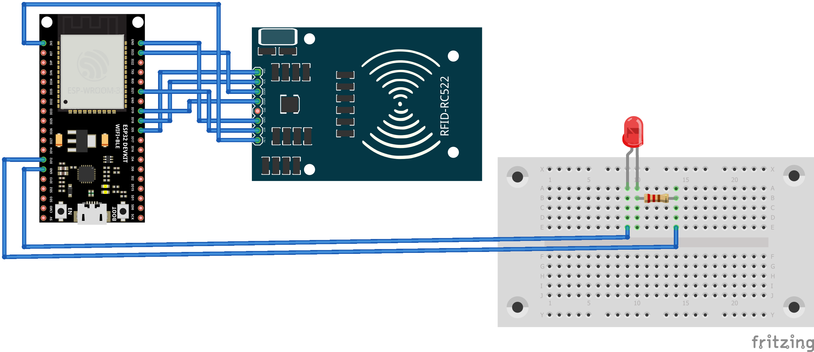

# ESP32 and RC522 Security Tutorial

## Introduction

ESP32 Tutorial and excercises around the security using ESP32 device, its periferals and integration with internet servers.

## Schematics

## Needed libraries

You will need to add the following libraries to your Arduino IDE:
- RFID_MFRC522v2
- PubSubClient
